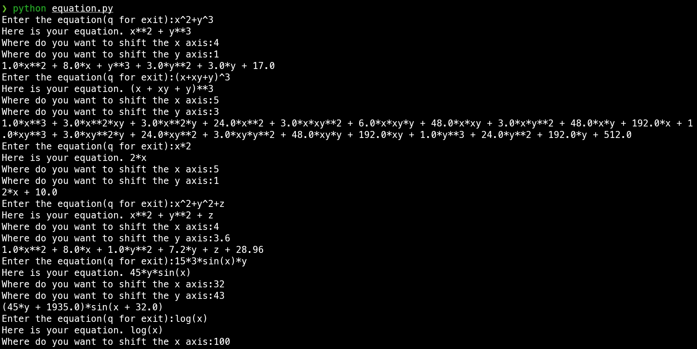

# prova-mam-project
This project is about shift of axis.

Deadline:Don't know.

## How to install
1. First you need to install python.
2. Then you need to execute this command,
```bash
pip install sympy
```
3. Then you can run using 
```bash
 python equation.py 
```
### Some examples:


This is the graph algorithm I am currently working.

