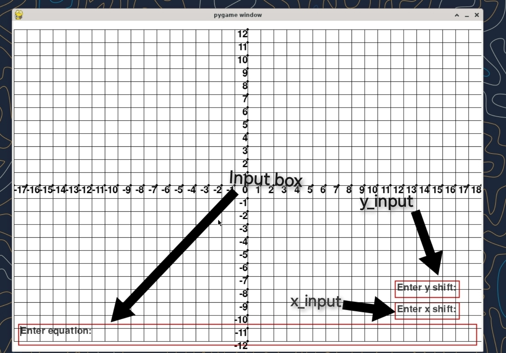
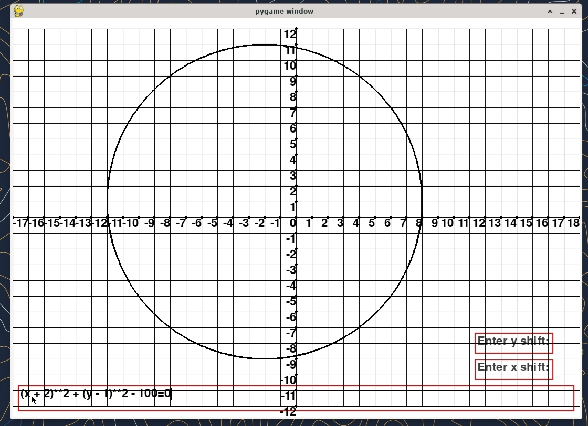
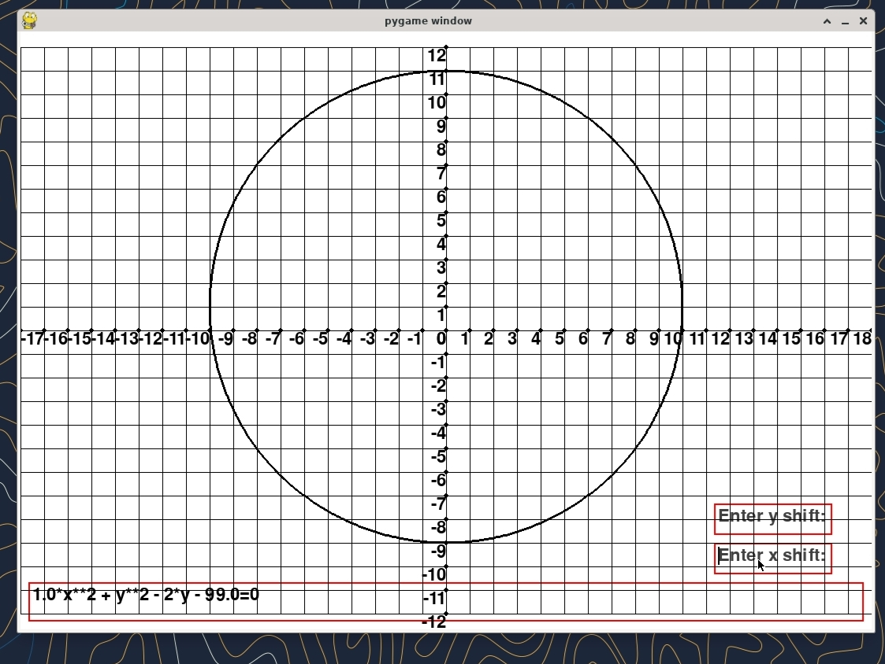

If you are reading this readme file.Go to this link
https://github.com/irfan-hossain-bhuiyan/prova-mam-project

----------
### Group A : COEFFICIENTS 
#### TOPIC: Change of Axes-1 

Roll         |Name                         |Designation    |Email
-------------|-----------------------------|---------------|---------------------------------|
2103088      |Irfan Hossain Bhuiyan       |Developer and Coder|irfanhbhy@gmail.com |
2103069      | Dina Sanjida                |Co-Ordinator   |dinasanjida0210@gmail.com | 
2103065      | Md. Morakib Hossain         |Coder          |morakibnashit@gmail.com   |
2103102      |Md. Anamul Haque             |Coder          |mdanamulhaque2084@gmail.com| 
2103115      |Abdullah Al Maruf            |Coder          |abdullahovi.official@gmail.com|
2103084      |Bishal Chandra Barmmon       |Math Solver    |bishalchandra44@gmail.com|
2103111      |Nazifa Fairuz Zuthi          |Math Solver    |startrack613@gmail.com|
2103119     |Arif Foysal Bin Haider        | Math Solver   |ariffoysalruetcse21@gmail.com |
2103091     |Md. Meherul Islam Arfi        |Presenter      |meherul.jes003@gmail.com |
2103083     |Mohammad Farhan Labib Khan    |Presenter       |labib1925@yahoo.com|

---------

# Math-1213 project
Our project is about change of axes.Means how a equation will change after I want to change the center point (0,0) to  point (a,b).

## Setted Goal
In our project,we set this goal,

1. Make an ui that I can visualize the input and output accordingly.
2. Taking an equation as a user input.
3. Taking input of where you want to shift the equation in the x axis and y axis.
4. and return output with the modified equation.
5. Visualize the change in a graph to see,how the graph changes with the shift of axis.
6. Being simple

We did touched every one of those,We could add more,by the time being we restricted ourselve in simple.

### The things we wanted to added but didn't got time

1. A animation to show the graph is moving and visualzie it beutifully other then instantly.


Now first see what our program can do,


### Running the program.
There is already a precompiled program in the bin folder.

1. Go to the bin folder.
2. Extract the main folder.
2. Run the main file.
This it what you will see


- Now click in the input_box and type a valid equation.
    - A valid equation will have one ```=``` sign.
    - Only small ```x ,y ``` are allowed.
    - Any key other than ```0123456789^*+-=/()xy.``` aren't allowed.
    - You can use power by using ```**``` or ```^``` key
    - An example is ```(x+2)^2+(y-1)^2=100```.If you type it you will get something like this->


    - After inputing -2 in the ```x input shift``` the graph shift,The circle comes to hte center again.



### Running from script.
Also it can be compiled to source.
To do that,
1. Install python 
2. Run in the command promt:
```bash
pip install numpy pygame contourpy sympy
```
3. After you run the program by running the ```main.py```

## Architure of the project

I am only using python in my project.

### File structure
```
.
├── README.md
├── doc_images
├── equation
│   ├── __init__.py
├── external_dependencies
│   ├── __init__.py
│   └── color.py
├── main.py
└── ui
    ├── __init__.py
    ├── graph_ui.py
    ├── input_box.py
    ├── input_box_temp.py
    └── ui_component_trait.py
```
So there are a lot of files.

### Dependencies
The dependencies I am using in the project:

1. pygame *this is a game library I am using for the ui.Being so basic it gives me a lot of freedom.*
2. numpy *Numpy is a matrix library. To  do fast numarical calculation numpy is a must.*
3. contourpy *This is a library to get 2d intersection point of the 3d graph.It is really performant*
4. sympy *As the document says It is a computer algebric system.*

### Project explaination
In the start of the project,There are 3 folder and 1 file.

1. ui (*This handle all ui component like graph,text_box*)
2. equation (*This handle converting the user input to equation so I can evalute the equation as function of x,y in 3 dimension.Also it intersect the 3d geometry and intersect it with **xy** plane.*)
3. external_dependencies (*I separated this one for external dependencies.But I rarely needed it.*
4. ```main.py``` (*This is the main file you need to run.*)

### UI 
The ui folder has graph_ui and input_box
1. graph_ui is to render the graph
    #### Graph ui
    - It has some function to change the screen coords to graph coords and vice versa.```to_screen_coords,to_graph_coords```
    - It also create grid lines and render other line fast.
    - It doesn't have any zooming or moving capabilities. So you can't see something outside specified range.
    
2. input box is to take input from you.
    #### Input box
    - Input box just takes input.
    - You can't copy or paste something in it.
    - It has been implemented from scratch.

### Equation
The equation folder has one file in it. It is to convert the user string to 
equation using sympy.This is the main function in it.
```python
def convert_to_standard_form(equation_str):
    # Define symbols
    def transform_equation_string(equation_str):
        transformed_str = ''
        i = 0
        while i < len(equation_str):
            current_char = equation_str[i]
            if current_char.isalpha() and i > 0 and equation_str[i-1].isdigit():
                transformed_str += '*'
            transformed_str += current_char
            i += 1
        return transformed_str    

    equation_str=transform_equation_string(equation_str) 
    try:
        eqLeftStr,eqRightStr=equation_str.split("=",1)
        # Parse the input equation string into a SymPy expression
        eqLeft = sp.sympify(eqLeftStr)
        eqRight= sp.sympify(eqRightStr)

        # Ensure the result is an equation (Equality type)
            # Subtract the right-hand side from both sides to get the standard form
        standard_form = eqLeft - eqRight
        return standard_form

    except:
        return None
```
1. First the function takes the user string say ```"3x+4y+xy=10x"```
2. Then it convert it to ```"3*x+4*y+x*y=10*x"```
3. It split it by equal sign and then lhs=```3*x+4*y+x*y``` and rhs=```10*x```
4. Then create a function out of it. f(x,y)=```lhs-rhs```

The equation to line function 
```python
def equation_to_line_func(equation):
    equation_function = sp.lambdify((x, y), equation, "numpy")
    def to_lines(xmin,xmax,ymin,ymax,resolutionx,resolutiony):
        x = np.linspace(xmin,xmax,resolutionx)
        y = np.linspace(ymin,ymax,resolutiony)
        X, Y = np.meshgrid(x, y)
        c=contour_generator(z=equation_function(X,Y))
        matrix_lines=c.lines(0)
        if len(matrix_lines)==0:
            return np.array([])
        graph_lines=[matrix_line/np.array([resolutionx-1,resolutiony-1])*np.array([xmax-xmin,ymax-ymin])\
        +np.array([xmin,ymin]) for matrix_line in matrix_lines]
        return graph_lines
    return to_lines
```

1. Uses the function given above and generate a range values from it.
2. Then using linear approximation check where they are intersecting the xy plane and return list of lines to render.

### Main.py file
```python 
x,y=sp.symbols("x y")
GRAPH_RESOLUTION=20
equation=None
SCREEN_WIDTH ,SCREEN_HEIGHT =1080,760
def from_left(x:int):
    return x
def from_right(x:int):
    return SCREEN_WIDTH-x
def from_top(y:int):
    return y
def from_down(y:int):
    return SCREEN_HEIGHT-y


def main():
   pygame.init() 
   screen=pygame.display.set_mode((SCREEN_WIDTH,SCREEN_HEIGHT))
   #lines=[]
   graph=Graph(x=0,y=0,screen=screen,width=SCREEN_WIDTH,height=SCREEN_HEIGHT)
   def onInputBoxEnter(inputBox:InputBox):
       input=inputBox.text
       if input=="":
           return
       global equation
       equation_temp=convert_to_standard_form(input)
       if equation_temp is None:
           inputBox.panic("The equation is not valid.")
       else:
          equation=equation_temp
          inputBox.text=str(equation)+"=0"
          equation_to_graph_render(equation,graph,GRAPH_RESOLUTION) 
  
       
   inbox=InputBox(screen,x=from_left(10),y=from_down(60),width=SCREEN_WIDTH-20,height=50,\
           onEnter=onInputBoxEnter,placeholder="Enter equation:",\
           allowed_key='0123456789^*+-=/()xy.',active=True,rect_color=color.RED,placeholder_color=color.DARK_GRAY)
   def onXInputEnter(box:InputBox): 
       global equation
       if equation is None:
           return
       text=box.text
       if text=="":
           return
       try:
           text=float(eval(text))
           #x=sp.symbols("x")
           equation=sp.expand(equation.subs(x,x+text))
           inbox.text=str(equation)+"=0"
           equation_to_graph_render(equation,graph,GRAPH_RESOLUTION)
           box.text=""
       except:
           box.panic("Can't evaluate input.")

   def onYInputEnter(box:InputBox):
       global equation
       if equation is None:
           return
       text=box.text
       if text=="":
           return
       try:
           text=float(eval(text))
           #y=sp.symbols("y")
           equation=sp.expand(equation.subs(y,y+text))
           inbox.text=str(equation)+"=0"
           equation_to_graph_render(equation,graph,GRAPH_RESOLUTION)
           box.text=""
       except:
           box.panic("Can't evaluate input.")


   x_input=InputBox(screen,x=from_right(200),y=from_down(110),width=150,rect_color=color.RED,\
           height=40,onEnter=onXInputEnter,placeholder="Enter x shift:",
                        allowed_key='0123456789^*+-=/().',placeholder_color=color.DARK_GRAY)
   y_input=InputBox(screen,x=from_right(200),y=from_down(160),width=150,rect_color=color.RED,\
           height=40,onEnter=onYInputEnter,placeholder="Enter y shift:",
                    allowed_key='0123456789^*+-=/()',placeholder_color=color.DARK_GRAY)
   components:List[Tcomponent]=[inbox,x_input,y_input,graph]
   running=True
   while running:
       try:
           for event in pygame.event.get():
                 if event.type == pygame.QUIT:
                     running = False
                 for component in components:
                         component.handle_event(event)
           screen.fill(color.WHITE)
           for component in components:
                 component.draw()
             # Draw the graph
            # for x in lines:
            #     graph.draw_linesC(x,width=3)
           pygame.display.flip()
       except:
           inbox.panic("Some error occured.Don't know.")
   pygame.quit()

if __name__=="__main__":
    main()
```

1. It create the basic UI setup.Draws graph,input_box,equation management etc.
2. After taking input from ```x_input``` and ```y_input``` it replaces the equation with 
```x=x+x_input``` and ```y=y+y_input``` and render the graph accordigly.
3. Then also input the input box accordingly.

Yeah,This is the simplified version how the program runs under the hood.


## Result
Making a graphing calculator,with visualing the change of axis,This kind of project is new to us.
There are several things we learned from here:
1. Studied about computer algebric system.This are tools to work with mathematical expression.
It can solve from basic math problem,expand or factor polynomial and solve differential equation.

One library like this was **sympy**

2. Understand how  graph algorithm works.Understand about contour.
3. Turns out graphics library is not good for this kind of job.But we did it anyway.


<p align="center"> The End</p>
Thanks for giving a project like this.It was a wonderful experinece.

